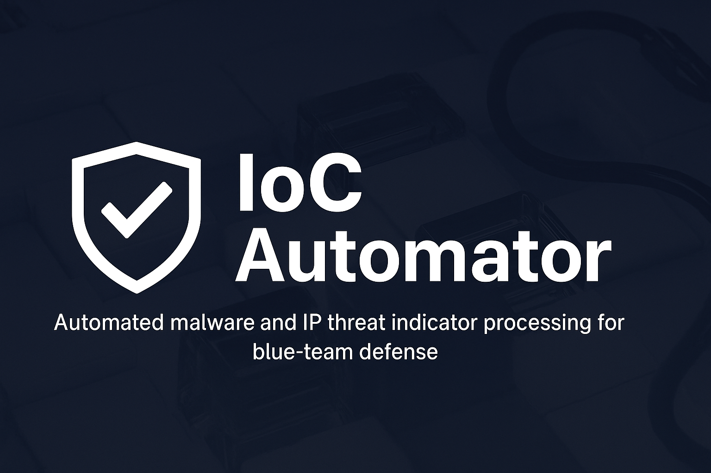
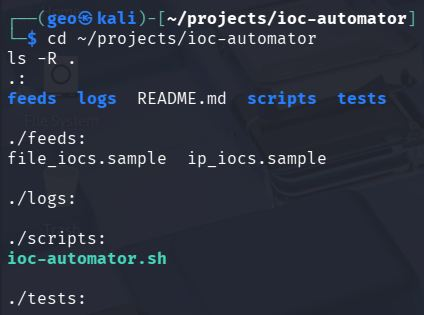
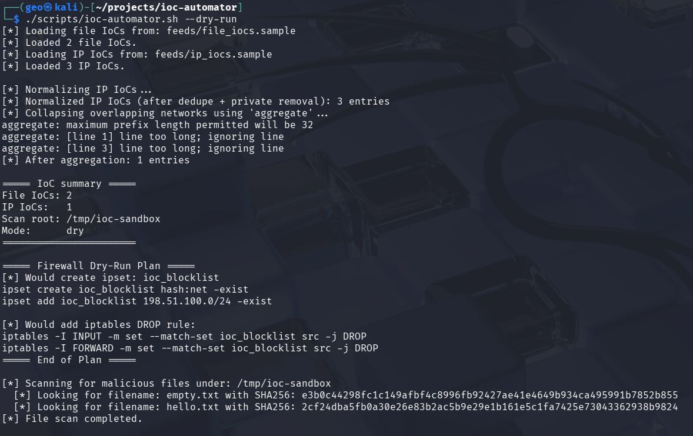
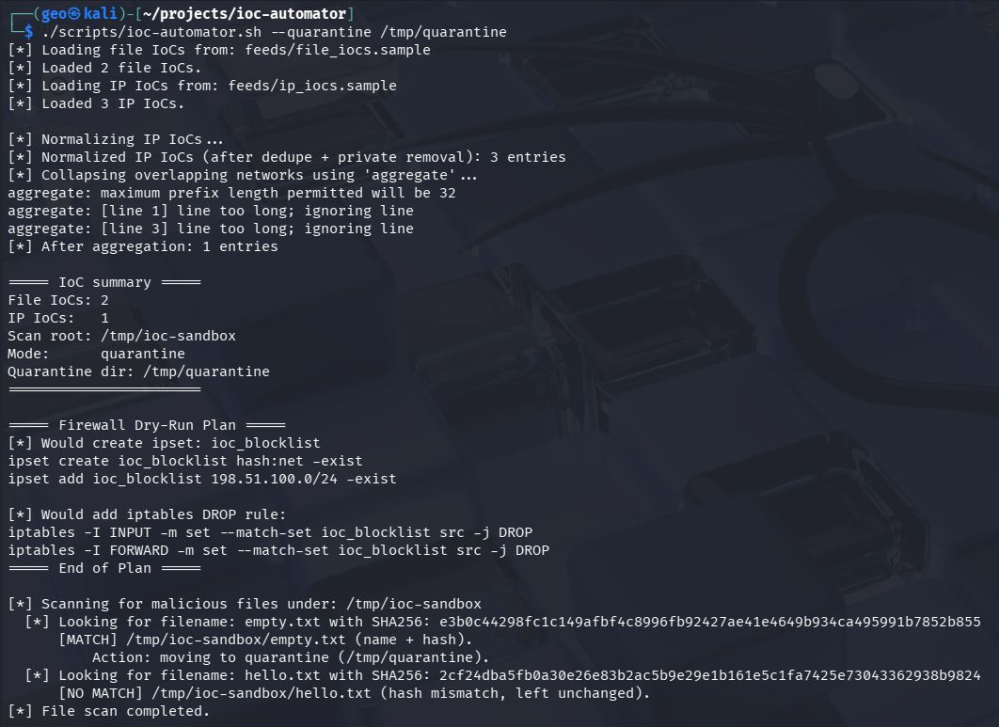
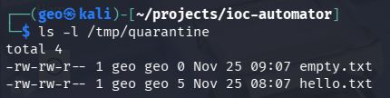
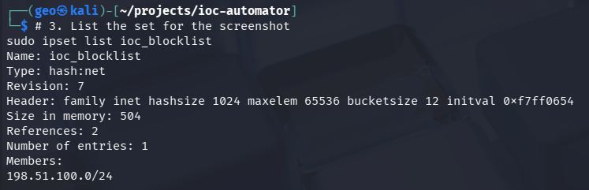
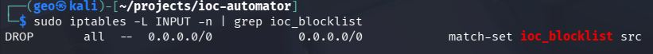
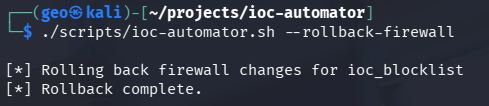

🛡️ IoC Automator

Automated malware and IP threat indicator processing for blue-team defense

Note:
This project, including the Bash scripts, structure, and documentation, was created with the assistance of AI as part of my continuous learning in cybersecurity, automation, and threat-intel engineering.
The repository serves as a learning project, a portfolio showcase, and a practical demonstration of security automation concepts.

<p align="center">  </p> <p align="center"> <a href="https://github.com/georgegiannakidis/ioc-automator/stargazers">  </a> <a href="https://github.com/georgegiannakidis/ioc-automator/issues">  </a> <a href="https://github.com/georgegiannakidis/ioc-automator/pulls">  </a>    </p>
📌 Overview

IoC Automator is a security automation tool designed to help blue-team defenders process Indicators of Compromise (IoCs) from threat intelligence feeds and take safe automated actions such as:
- Detecting malicious files (filename + SHA256)
- Quarantining or deleting confirmed malware
- Processing IP and CIDR IoCs
- Automatically generating firewall blocklists using ipset + iptables
- Normalizing and deduplicating threat-intel data
- Running in safe dry-run mode by default
- Rolling back all firewall changes cleanly

This project demonstrates hands-on defensive automation skills used in SOC, IR, and threat-hunting workflows.

🔥 Features
**File IoC Processing**
- Parse filename + hash IoCs
- Calculate SHA-256 hash of located files
- Match filename + content
- Actions:
  - Dry-run
  - Quarantine
  - Delete

**IP IoC Firewall Automation**
- Normalize IPs and CIDR blocks
- Remove duplicates
- Remove private address ranges
- Aggregate networks
- Build firewall blocklists with ipset
- Create DROP rules in iptables
- Full rollback capability

**Safety by Design**
- Dry-run mode shows actions without performing them
- No file deletion unless explicitly requested
- Firewall rollback restores system state cleanly

📁 **Project Structure**
```ioc-automator/
├── feeds/
│   ├── file_iocs.sample
│   └── ip_iocs.sample
├── scripts/
│   └── ioc-automator.sh
├── logs/
├── tests/
├── screenshots/
└── README.md
```
📸 Screenshots
Project Structure




Dry-Run Execution




Quarantine Mode




Quarantine Folder:




Firewall Dry-Run Plan


Firewall Applied




iptables Rule Confirmation:




Firewall Rollback



🚀 Usage
Dry run (default)  
`./scripts/ioc-automator.sh --dry-run`

Quarantine malicious files  
`./scripts/ioc-automator.sh --quarantine /tmp/quarantine`

Delete malicious files  
`./scripts/ioc-automator.sh --delete`

Apply firewall rules  
`./scripts/ioc-automator.sh --apply-firewall`

Rollback firewall changes  
`./scripts/ioc-automator.sh --rollback-firewall`

📄 IoC Feed Format
File IoCs (SHA256 + filename)

Example:

```e3b0c44298fc1c149afbf4c8996fb924 empty.txt```

```2cf24dba5fb0a30e26e83b2ac5b9e29e1 hello.txt```

IP IoCs
`198.51.100.0/24
192.0.2.15
203.0.113.88`

🎯 Learning Purpose
This project was created with the assistance of AI as part of a learning journey into:
Security automation
Threat intelligence processing
Bash scripting
Linux firewall management
Blue-team defensive workflows
The goal is education, skill development, and portfolio presentation.

🪪 License
MIT License — free to modify and use.

⭐ Support the Project
If you like this project, please consider starring the repository:
https://github.com/georgegiannakidis/ioc-automator
